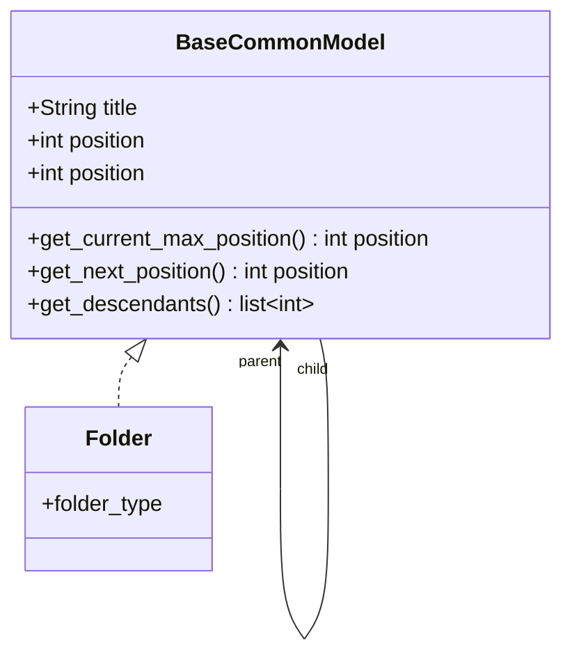
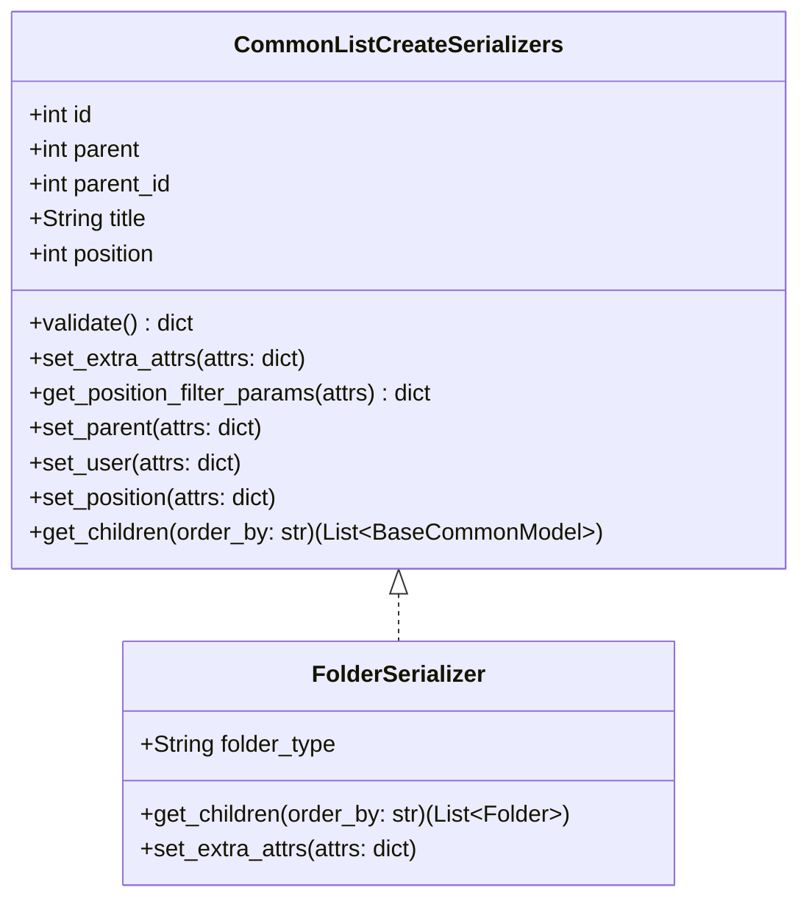

# 树形数据结构

## BaseCommonModel （树形数据结构基类）

构成树形数据结构的模型基类

##   

```mermaid
classDiagram

class BaseCommonModel{
    +String title
    +int position
    +int position
    
    +get_current_max_position() int position
    +get_next_position() int position
    +get_descendants() list~int~
}

class Folder{
    +folder_type
}

BaseCommonModel "parent" <-- "child" BaseCommonModel
BaseCommonModel <|.. Folder

```

## CommonListCreateSerializers （树形数据结构序列化基类）

##   

```mermaid
classDiagram

class CommonListCreateSerializers{
    +int id
    +int parent
    +int parent_id
    +String title
    +int position
    
    +validate() dict
    +set_extra_attrs(attrs: dict)
    +get_position_filter_params(attrs) dict 
    +set_parent(attrs: dict)
    +set_user(attrs: dict)
    +set_position(attrs: dict)
    +get_children(order_by: str) (List~BaseCommonModel~)
}

class FolderSerializer{
    +String folder_type 
  
    +get_children(order_by: str) (List~Folder~)
    +set_extra_attrs(attrs: dict)
}

CommonListCreateSerializers <|.. FolderSerializer

```
