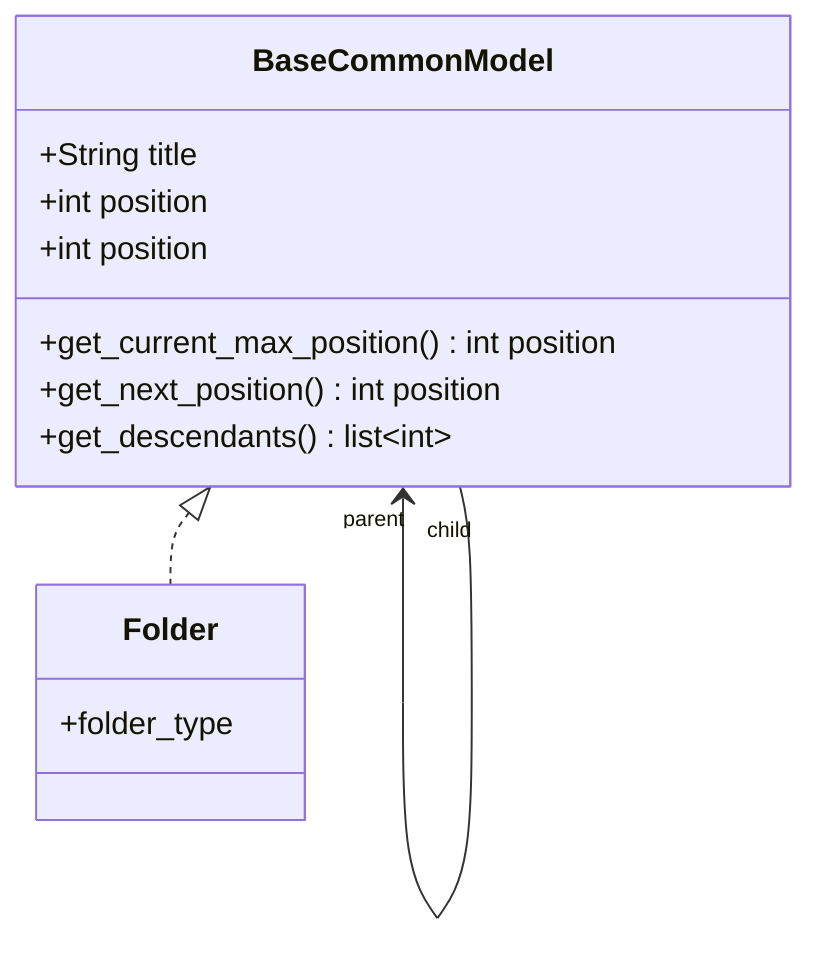
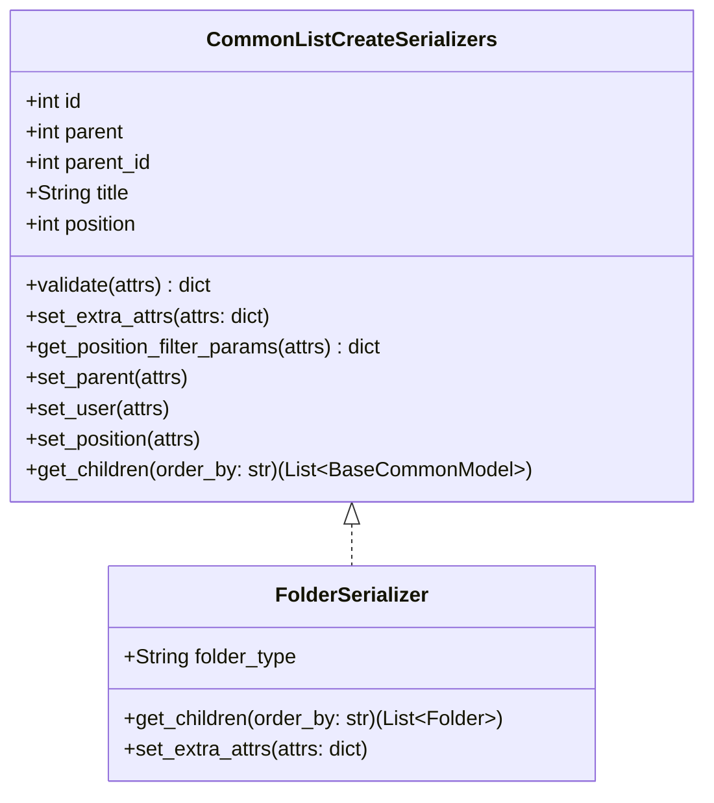

# 树形数据结构

## BaseCommonModel （树形数据结构基类）

构成树形数据结构的模型基类

##   

## CommonListCreateSerializers （树形数据结构序列化基类）

##   

## API介绍

### CommonListCreateSerializers

#### validate(attrs)
    DRF 序列化校验
    处理反序列化的数据写入 Model ，处理基类的 parent 、user 相关处理

#### set_extra_attrs(attrs)
    如果需要向 Model 保存其他数据，请重写此方法

#### get_position_filter_params(attrs)
    必须实现，自定义查询当前最大位置的过滤参数, 返回一个过滤条件的字典， 例如: {"user_id": 1} 或 {}

#### set_parent(attrs)
    通过参数 parent 或 parent_id ,对 parent_obj 进行校验，并设置 attrs["parent"] = parent_obj

#### set_user(attrs)
    将用户信息放入 attrs， attrs["user_id"] = 1

#### set_position(attrs)
    当 "parent" in attrs: 根据 parent 计算 position ，并设置 attrs["position"] = position 
    当 "parent" not in attrs: 需要提供查询当前最大位置的过滤参数 例如 {"user_id": 1}，根据条件计算 position ，并设置 attrs["position"] = position 

### BaseCommonModel

#### get_current_max_position(**kwargs)
    当 "parent" in attrs: 返回 parent 下最大的 position
    当 "parent" not in attrs: kwargs["parent"] = None 根据 kwargs 返回最大 position，
    根据条件返回当前最大 position
    
#### get_next_position(**kwargs)
    根据条件返回下一个 position